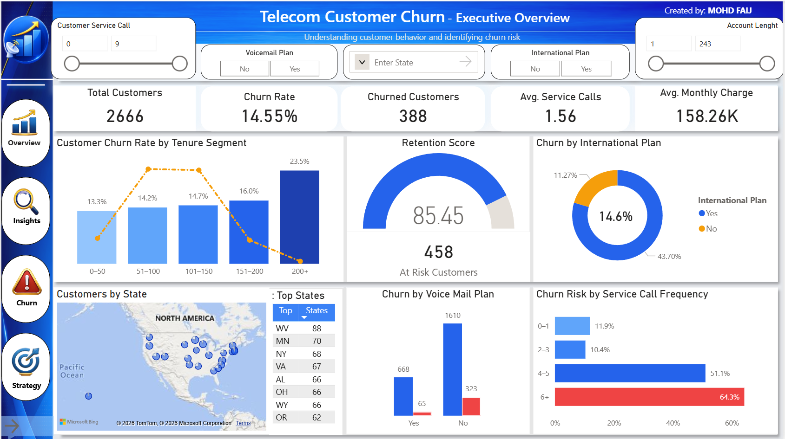
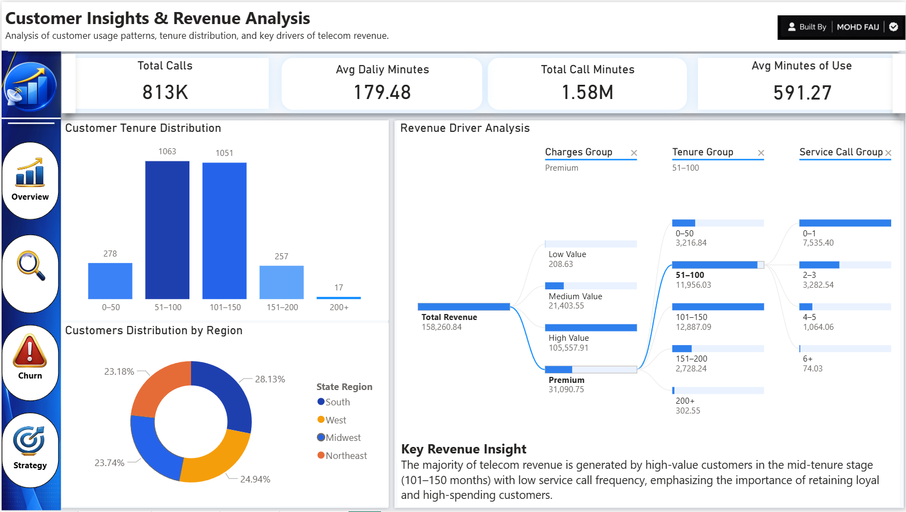
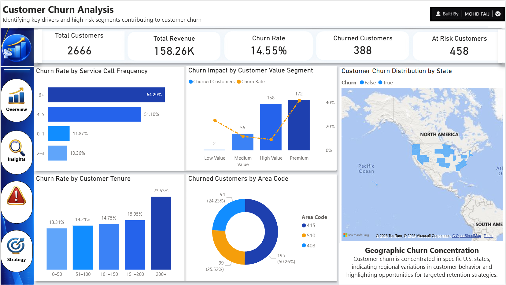
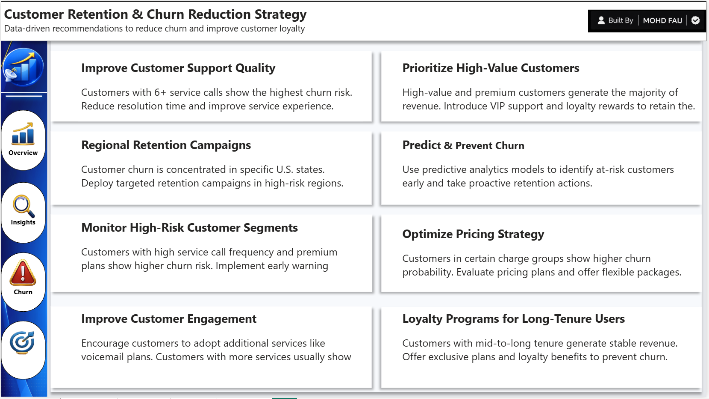

# 📊 Telecom Customer Churn Analytics Dashboard

Interactive **Power BI dashboard** analyzing telecom customer behavior, churn drivers, revenue segments, and retention strategies using data visualization and business intelligence techniques.

---

# 🧾 Project Overview

Customer churn is a major challenge for telecom companies because losing existing customers directly impacts revenue and long-term business growth.

This project analyzes telecom customer data to identify **key churn drivers**, evaluate **customer value segments**, and develop **data-driven strategies** to improve customer retention.

An interactive Power BI dashboard was developed to help businesses monitor churn patterns and make better strategic decisions.

---

# 🎯 Business Questions

This project answers several important business questions:

- Which customers are most likely to churn?
- What factors contribute most to customer churn?
- Which customer segments generate the most revenue?
- How can telecom companies reduce churn and improve retention?

---

# 📂 Dataset Overview

Dataset: **Telecom Customer Dataset**

The dataset contains telecom customer information including:

- Customer state and area code  
- Account length and tenure  
- Call usage patterns (day, evening, night, international)  
- Service call frequency  
- Voicemail and international plans  
- Customer churn status  

Total customers analyzed: **~2,600**

---

# 📊 Dashboard Pages

## 1️⃣ Executive Overview

Provides a high-level summary of telecom customer performance including churn rate, customer count, and service call patterns.

### Key Metrics
- Total Customers
- Churn Rate
- Churned Customers
- Average Monthly Charges
- Average Service Calls

### Key Insight
Customers with **6+ service calls show the highest churn probability**, indicating service dissatisfaction as a major driver of churn.

---

## 2️⃣ Customer Insights & Revenue Analysis

Analyzes customer behavior and identifies segments contributing the most to telecom revenue.

### Key Analysis
- Customer tenure distribution
- Call usage behavior
- Regional customer distribution
- Revenue contribution by customer segments

### Key Insight
**High-value customers in mid-tenure segments generate the majority of telecom revenue**, making them critical for retention strategies.

---

## 3️⃣ Customer Churn Analysis

Identifies key behavioral and geographic factors contributing to customer churn.

### Key Analysis
- Churn risk by service call frequency
- Churn by customer value segment
- Geographic churn concentration
- Tenure-based churn patterns

### Key Insight
Customers with **frequent support interactions and longer tenure show increased churn risk**, highlighting the need for proactive customer support strategies.

---

## 4️⃣ Customer Retention Strategy

Provides data-driven recommendations to reduce churn and improve customer loyalty.

### Strategic Recommendations

- Improve customer support response time
- Implement loyalty programs for high-value customers
- Launch targeted retention campaigns in high-churn regions
- Identify at-risk customers using predictive analytics
- Provide incentives for long-tenure customers

---

# 📈 Business Impact

This analytics solution helps telecom companies:

- Detect high-risk customers early
- Protect high-value revenue segments
- Improve customer support performance
- Implement effective customer retention strategies

---

# 🛠 Skills & Tools Used

- Power BI  
- SQL  
- Python  
- Data Visualization  
- Customer Analytics  
- Business Intelligence  

---

# 👨‍💻 Author

**Mohd Faiz**  

LinkedIn: [Mohd Faiz](https://www.linkedin.com/in/mohdfaij-data)

